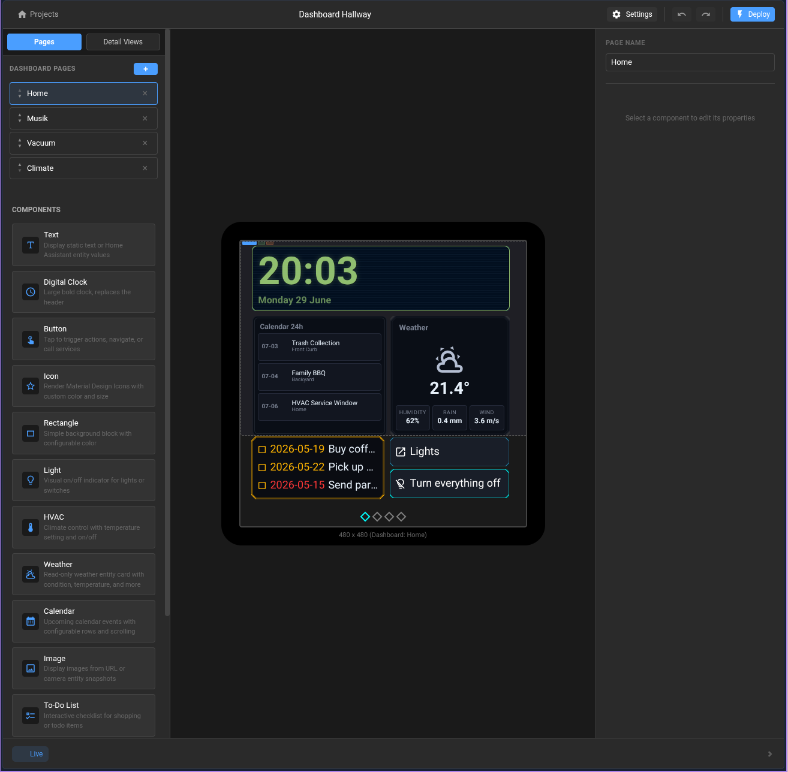
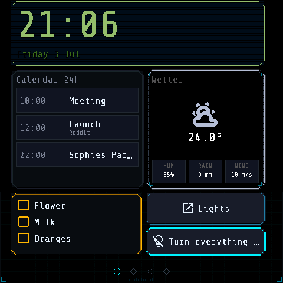

# vESP.cloud

Visual editor and firmware generator for ESPHome touch displays.

  

## What Is vESP.cloud?

vESP.cloud lets you design dashboards visually, generate production ESPHome firmware,
and integrate with Home Assistant for real-world smart home control.

## Hardware Support

vESP.cloud currently supports only the **Guition ESP32-S3-4848S040** display module:

- **Display**: 480 x 480 RGB
- **Driver IC**: ST7701S
- **Touch Controller**: GT911

## Free Firmware Generation

You can generate the full ESPHome firmware code for free.

- Design your UI in the editor
- Export/download the generated YAML and C++ include files
- Build and flash with your own ESPHome setup at no cost

## Home Assistant Integrations

The Home Assistant integrations are published independently for HACS and synced
into this repository under `integrations/`:

- [HA Metadata Exporter](https://github.com/poesterlin/ha-metadata-exporter)
- [vESP.cloud Notifications](https://github.com/poesterlin/ha-display-notifications)

## Screenshots

  
  

## Core Stack

- **Frontend**: Svelte 5, TypeScript, Bun
- **Codegen**: TypeScript + JSON schema driven generation
- **Firmware**: ESPHome + C++ headers/templates
- **HA Integrations**: Standalone HACS repositories synced with Git subtrees

## Quick Start

### Web editor

1. Go to `web/`
2. Install deps: `bun install`
3. Run: `bun run dev`

### Home Assistant integration

#### HACS (recommended)

1. Open HACS in Home Assistant
2. Go to **Integrations** -> **Custom repositories**
3. Add either standalone repository as an **Integration** repository:
   - `https://github.com/poesterlin/ha-metadata-exporter`
   - `https://github.com/poesterlin/ha-display-notifications`
4. Install the integration
5. Restart Home Assistant

#### Manual install

Copy the desired domain directory into Home Assistant's `config/custom_components/`
directory:

- `integrations/ha-metadata-exporter/custom_components/esphome_display`
- `integrations/ha-display-notifications/custom_components/esphome_display_notifications`

### ESPHome test firmware

1. Make sure ESPHome is installed
2. Go to `esphome/`
3. Compile: `esphome compile my-display.yaml`

## Repository Layout

- `web/packages/editor/` - SvelteKit editor app
- `web/packages/schema/` - project/component schema package
- `web/packages/assets/` - shared brand assets and screenshots
- `esphome/` - firmware projects and references
- `integrations/` - standalone Home Assistant repositories synced as Git subtrees
