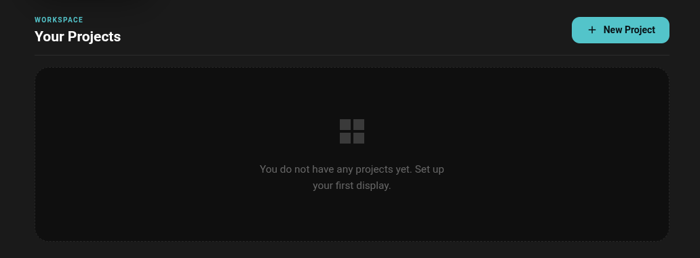
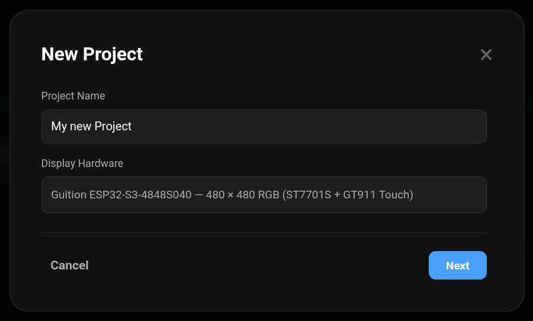
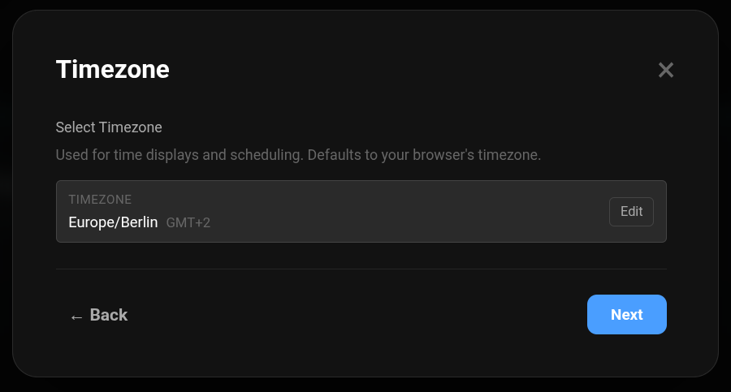
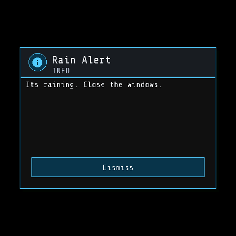
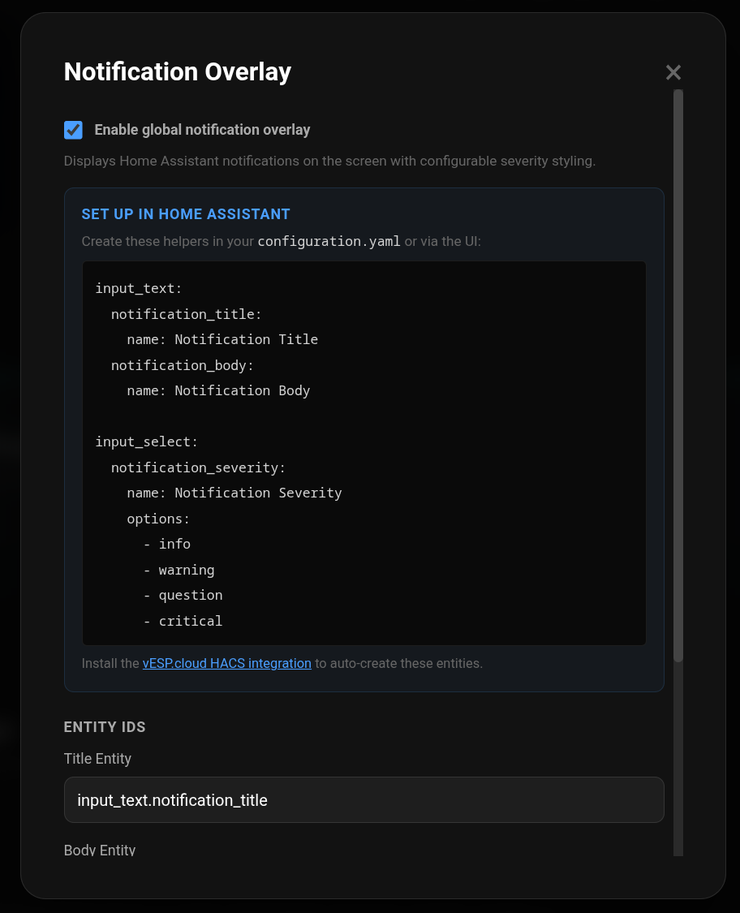
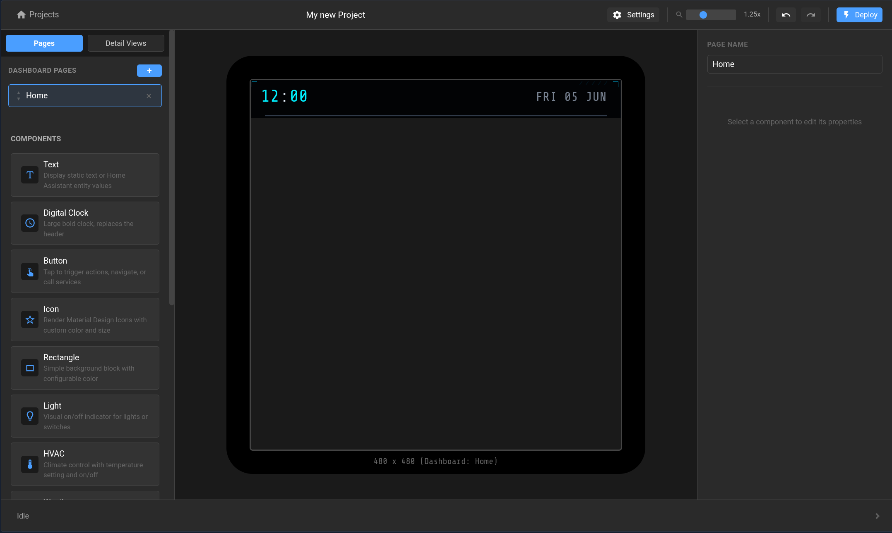

# Create your first project

From **Your Projects**, select **New Project** to open the project setup wizard.
The wizard collects the basic settings for your display.

## 1. Name the project

Enter a recognizable **Project Name**, such as the room or purpose of the
display. VESP Cloud currently supports the Guition ESP32-S3-4848S040 display.

Select **Next**.

## 2. Confirm the timezone

Confirm the timezone detected from your browser or select a different one. This
setting is used for clocks, dates, and time-based conditions on your display.

Select **Next**.

## 3. Configure notifications

The optional global notification overlay lets Home Assistant interrupt the
current screen with high-priority information. For example, an automation can
display a rain warning so someone can close the windows:

Enable **Enable global notification overlay** if you want this behavior. The
overlay reads three Home Assistant helpers:

- `input_text.notification_title` for the heading
- `input_text.notification_body` for the message
- `input_select.notification_severity` for `info`, `warning`, `question`, or
  `critical` styling

The setup wizard provides the configuration needed to create these helpers. If
your helper entity IDs differ, replace the defaults in the three entity fields.
You can also leave the overlay disabled and enable it later from **Settings →
Notification Overlay**.

Select **Create Project**. The editor opens with a Home dashboard page and an
empty 480 × 480 canvas. You can now drag widgets from the component palette onto
the display and configure the selected widget in the right sidebar.

