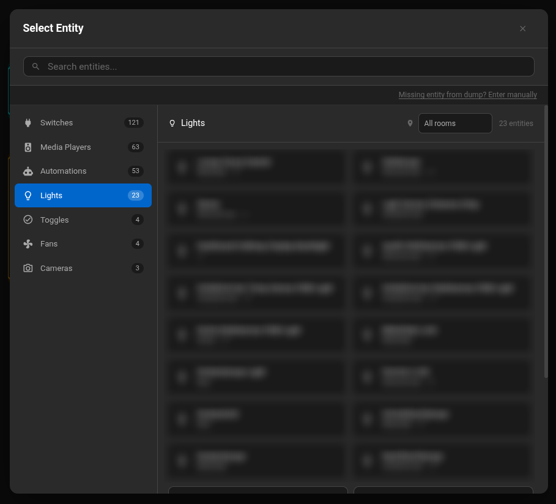

# Install the Home Assistant integration

The recommended **HA Metadata Exporter** integration makes entity selection in
the editor faster and more accurate. It exports configuration metadata for the
editor; it is not a live connection to Home Assistant.

## Install with HACS

1. In Home Assistant, open **HACS** and select **Integrations**.
2. Open the menu and choose **Custom repositories**.
3. Add the following repository URL and select **Integration** as its category:

   ```text
   https://github.com/poesterlin/ha-metadata-exporter
   ```

4. Find **HA Metadata Exporter** in HACS and install it.
5. Restart Home Assistant when prompted.
6. Go to **Settings → Devices & services**, select **Add integration**, and add
   **HA Metadata Exporter**. An exporter page will appear in the Home Assistant
   sidebar.

[Open the HA Metadata Exporter repository](https://github.com/poesterlin/ha-metadata-exporter)

## Export and import entity metadata

1. Open the exporter page in the Home Assistant sidebar.
2. Select **Download metadata**. Home Assistant downloads
   `ha-metadata.json`.
3. Return to the VESP editor and select **Import JSON Dump**, or drop the file
   into an entity picker.
4. Export and import a fresh file after adding, removing, or renaming Home
   Assistant entities. Existing project bindings are not changed automatically.

## A better entity-picking experience

The editor turns the imported metadata into a searchable entity picker. Entities
are grouped by domain, show friendly names and current example values, and can
be filtered by room. Domain and result counts make it easier to find the right
entity in a large Home Assistant installation.



The same information gives widget previews realistic values while you design
the display. After installation, the display gets current information directly
from Home Assistant.

::: info What is included
The export contains entity IDs, names, states, attributes, devices, services,
and areas. Passwords, access tokens, and GPS coordinates are removed. The
editor reads the file in your browser and stores it locally; it is not uploaded
to VESP Cloud.
:::

The metadata file only helps the editor find entities and show realistic
previews. Your display connects directly to Home Assistant after installation.

::: tip Troubleshooting
If the integration does not appear, confirm that Home Assistant was restarted
after the HACS installation. HA Metadata Exporter requires Home Assistant 2024.1
or newer.
:::
