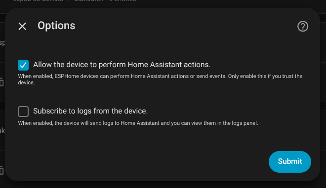
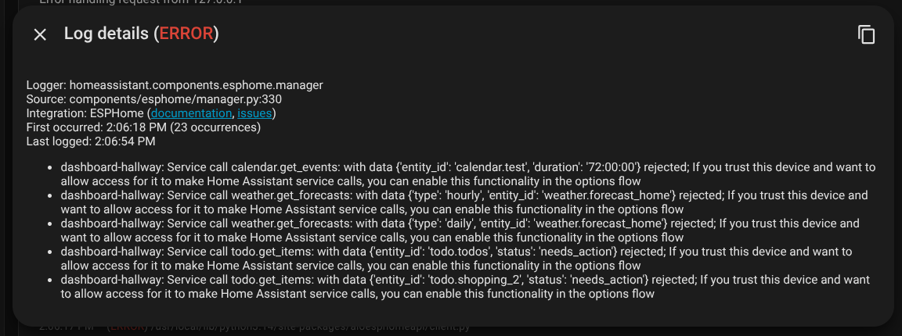

# Troubleshooting

Common issues and how to fix them.

## Some widgets or actions don't work

Home Assistant blocks actions from newly added ESPHome devices until you
explicitly allow them. If buttons, switches, to-do items, or other interactive
widgets do not trigger an action:

1. In Home Assistant, go to **Settings** &rarr; **Devices & services** &rarr;
   **ESPHome**.
   Alternatively, open [ESPHome integrations](https://my.home-assistant.io/redirect/integration/?domain=esphome)
   to go there directly.
2. Select your display device.
3. Open the device's **Options**.
4. Enable **Allow the device to perform Home Assistant actions** and select
   **Submit**.

Only enable this option for devices you trust. Subscribing to device logs is
not required for actions to work.

## OTA updates

### Device screen is flickering after OTA update

A proper fix is still in the works. The updates sometimes have an impact on the device stability and the screen alignment.
This can be worked around by rebooting the device. 
Either by unplugging it or by hitting the "reboot" button on the Home Assistant device screen.

### Updates do not appear in Home Assistant

1. Open **Settings** &rarr; **System** &rarr; **Updates** in Home Assistant to
   check for available updates.
2. Confirm the display is online in Home Assistant (**Settings** &rarr;
   **Devices & Services** &rarr; **ESPHome**).
3. Confirm the latest build completed successfully on the deploy page. If the
   build failed, fix the reported errors and build again.
4. The display checks for updates periodically. It may take a few minutes
   after a build finishes for the update to appear.

## Check Home Assistant logs

When debugging issues, inspecting Home Assistant's logs can reveal errors
from ESPHome devices and automations. Open
[Home Assistant logs](https://my.home-assistant.io/redirect/logs/) to go
there directly.

## Build errors

### Project validation fails

The editor checks your project for issues before building. Common causes:

- A widget is bound to a Home Assistant entity that is not in the imported
  entity dump. Import or re-import your entity dump.
- An entity ID or attribute name is misspelled.
- An icon name is not a valid Material Design Icon.

Use **Go to issue** to jump to the affected widget and correct it.

## Still having issues?

Reach out to [support@vesp-cloud.com](mailto:support@vesp-cloud.com) with:

- The project name
- A description of what you expected and what happened
- Your browser and operating system
- Any error messages shown in the editor or on the deploy page
