# Widgets

Widgets are the building blocks of a display layout. Drag one from the editor's
component palette onto a page, then configure its appearance, behavior, and Home
Assistant bindings in the property editor.

Every widget can be positioned and resized. Widgets connected to Home Assistant
stay up to date automatically.

## Text

Displays a static label or live Home Assistant values. Text can contain entity
placeholders such as <code v-pre>{{sensor.living_room_temperature}}</code> and
attribute placeholders such as <code v-pre>{{weather.home.temperature}}</code>.

Configure the font size, color, and left, center, or right alignment.

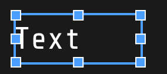

Text templates can combine labels with live entity values:

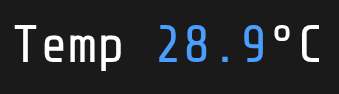

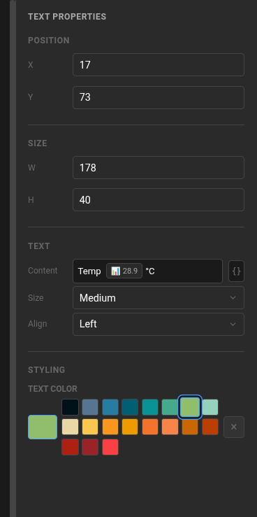

## Digital clock

Displays a large clock using the project's configured timezone. A digital clock
on a dashboard page replaces the regular page header so the time can use the
full header area.

Choose the clock color. The time updates automatically.

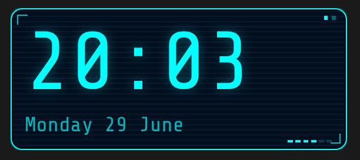

## Button

Creates a tappable control. A button can call a Home Assistant service or
navigate to another screen.

Choose its label, Material Design icon, text, background, border, and active
colors.

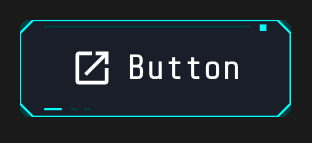

### Home Assistant action

Choose **Home Assistant Action** for **On Tap** to call a service or action on
an entity. Select the target entity and enter the action, such as
`media_player.media_pause` and the media player target.

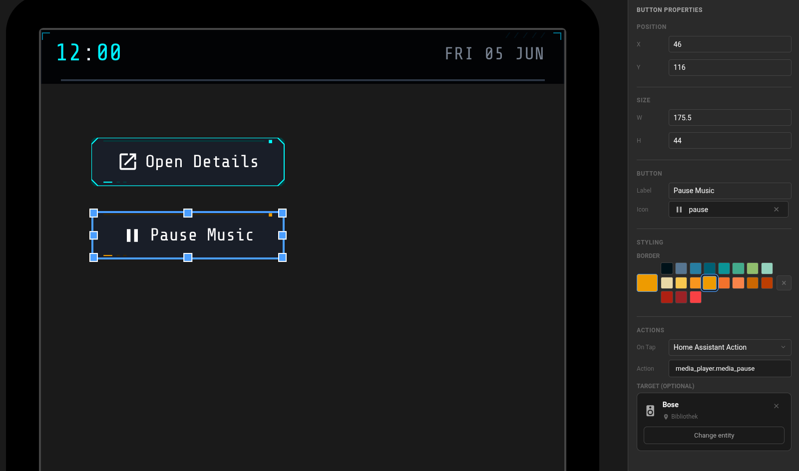

### Navigation

Choose **Navigation** for **On Tap** to open a detail view or move to another
screen. Select the navigation type and the target page from the button
properties.

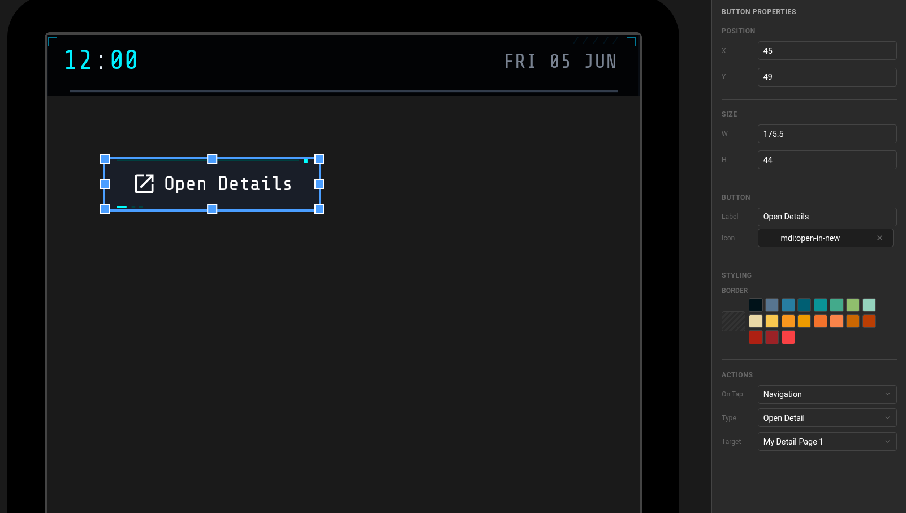

## Icon

Shows a Material Design Icon. Use icons as status indicators, decoration, or
part of a larger control assembled from several widgets.

Configure the icon, color, and scale.

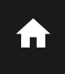

## Rectangle

Adds a solid color block. Rectangles are useful for page backgrounds, cards,
separators, and grouping related content visually.

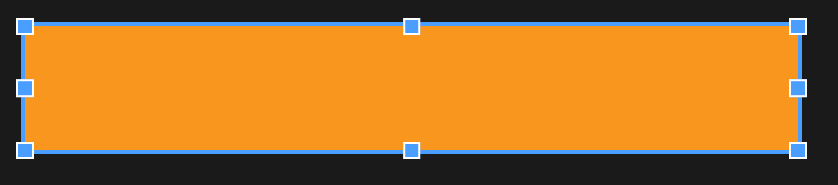

## Light

Displays and controls a Home Assistant light or switch. Its status stays in sync
with Home Assistant.

Configure the label, entity binding, target device, on/off text and colors,
icon, and optional brightness control.

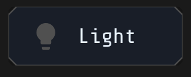

## HVAC

Provides climate controls for a Home Assistant climate entity. It shows the
current state and allows the target temperature and power state to be changed.

Configure the label, temperature step and range, mode used when turning on, and
on/off colors.

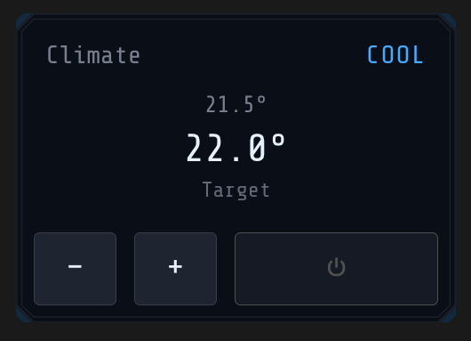

## Weather

Shows data from a Home Assistant weather entity. Use the compact `today` mode
for current conditions or `forecast` mode for a three-day forecast.

The displayed information is read-only and follows updates from the bound
weather entity.

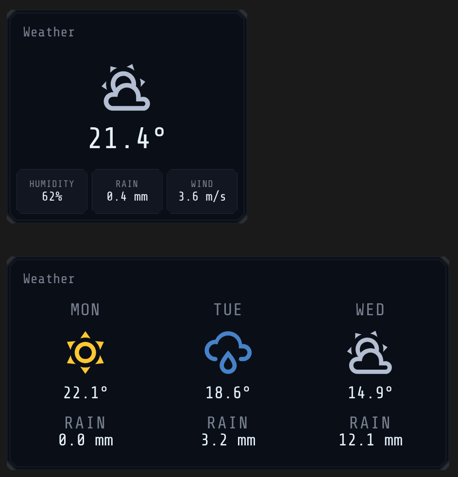

## Calendar

Lists upcoming events from a Home Assistant calendar.

Choose the label, maximum number of events, number of days to show, and whether
the event list can scroll.

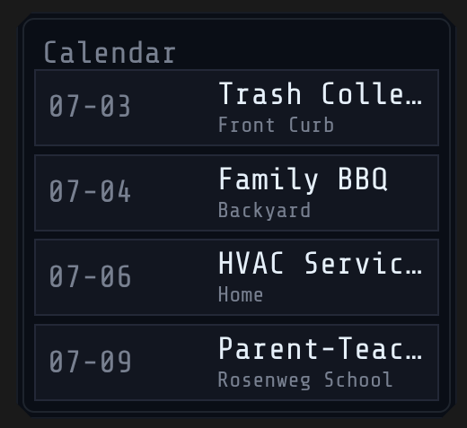

## Image

Displays an uploaded image or an image from a Home Assistant image or camera
entity.

Choose the image source, size, colors, and transparency in the widget settings.

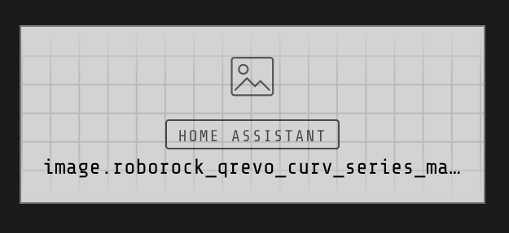

### Home Assistant image URLs

Home Assistant entities often expose relative image paths such as
`/api/image_proxy/...`. For these images, open **Project Settings** and enter
the **Home Assistant Base URL**, including its protocol and port when needed,
for example `http://homeassistant.local:8123`.

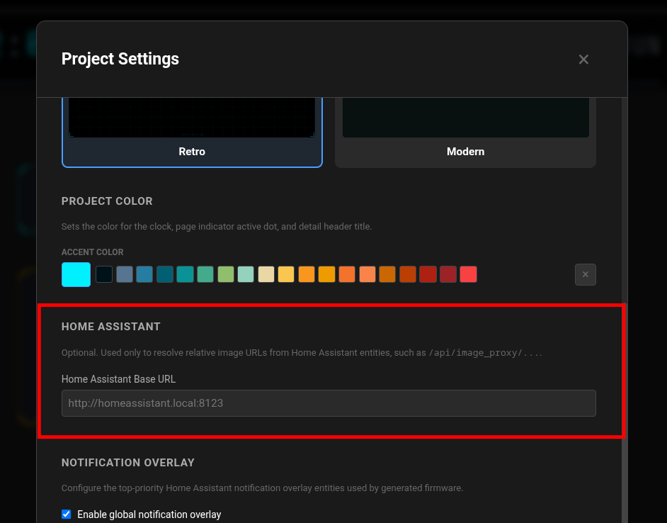

## To-do list

Displays items from a Home Assistant to-do list. When enabled, users can tap an
item to mark it complete.

Configure the entity, maximum number of items, row height, scrolling, check-off
behavior, and text color.

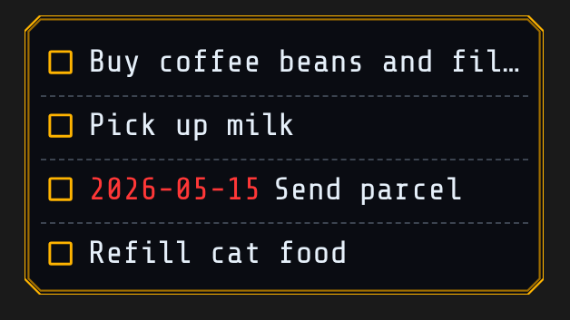

## Tabs

Organizes widgets into named tabs within one area. Users can tap a tab to show
its content.

Choose the tabs, the tab shown first, and whether content stays within the tab
area.

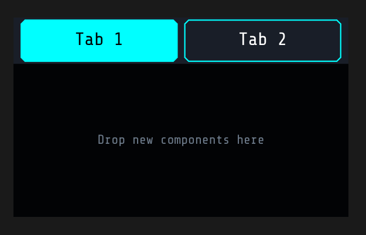

## Conditional area

Shows different groups of child widgets based on entity, state, time, or compound
conditions. A conditional area can select the first matching variant or use
variant priorities. For example show buttons for media player control if its playing media, and a couple of "Start Playlist" buttons if its not. 

Choose the variants, an optional default, how matching variants are selected,
and whether content stays within the area.

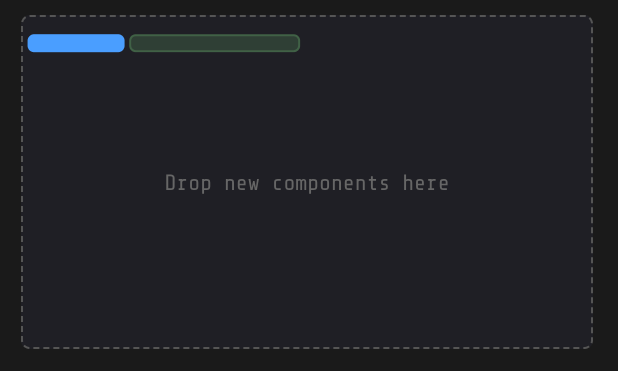

This example shows a `Playing` variant that appears when the selected Home
Assistant entity has the value `playing`:

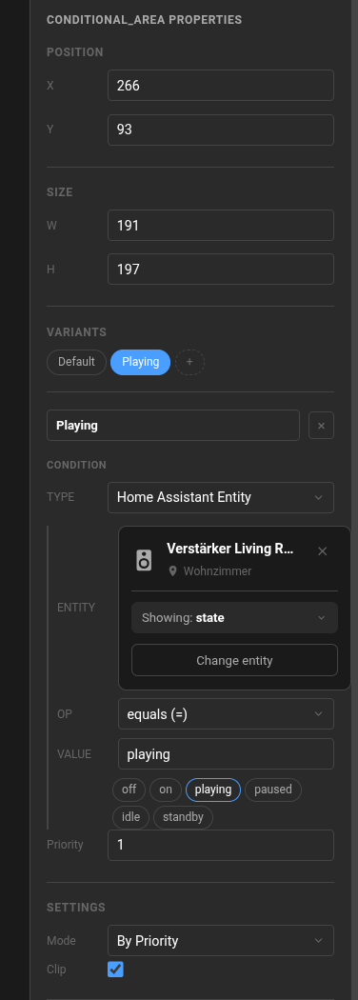
